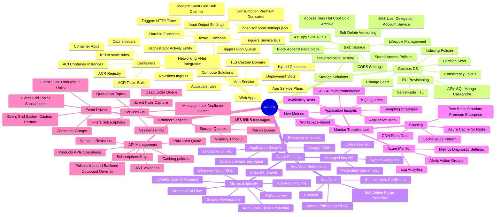
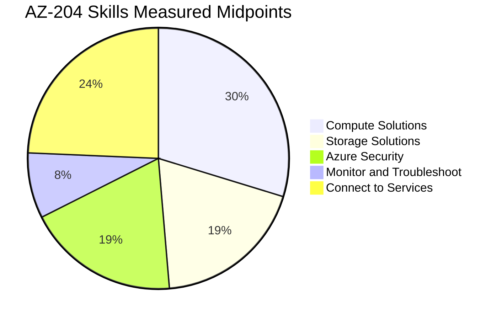

# AZ-204 - Developing Solutions for Microsoft Azure

> Visual study guide. Concept-only. Exam retires **July 31, 2026** - prep accordingly.

## How to use this guide

1. Skim this index to map the five exam domains.
2. Open each domain page and study the Mermaid concept map.
3. Run through the **Exam Decision Reference** (cheatsheet) and **Flashcards**.
4. Practice with the **AI Copilot Quiz** launcher.
5. Verify on the official **Practice Assessment** before booking.

## Exam at a glance

| Item | Value |
|---|---|
| Code | AZ-204 |
| Title | Developing Solutions for Microsoft Azure |
| Role | Azure Developer Associate (Intermediate) |
| Duration | 100 minutes |
| Pass | 700 / 1000 |
| Cost | $165 USD |
| Languages | EN, JP, ZH-CN/TW, KO, FR, DE, ES, PT-BR, IT |
| Last updated | 14 Jan 2026 |
| Retirement | **31 Jul 2026** |

## The 5 Exam Domains - Mind Map

## Official Skills Weighting

## Pages

| # | Page | Purpose |
|---|---|---|
| 01 | [Develop Azure compute solutions](01-compute.md) | Containers, App Service, Functions |
| 02 | [Develop for Azure storage](02-storage.md) | Cosmos DB, Blob Storage |
| 03 | [Implement Azure security](03-security.md) | Auth, Key Vault, Managed Identities |
| 04 | [Monitor, troubleshoot, optimize](04-monitor.md) | Application Insights |
| 05 | [Connect to services](05-connect.md) | APIM, Event Grid/Hubs, Service Bus, Queue |
| 05 | [Exam Decision Reference](05-exam-cheatsheet.md) | Pick-the-right-service tables |
| 06 | [Concept & Reference Index](06-references.md) | Cross-domain index |
| 07 | [Extra Concepts](07-extra-az204-concepts.md) | Edge cases & lesser-known knobs |
| 08 | [Microsoft Learn Summaries](08-learn-summaries.md) | Curated learning paths |
| 09 | [Architectures](09-arch-az204.md) | End-to-end developer patterns |
| 11 | [Microsoft Reference Library](11-microsoft-resources.md) | Official docs by service |
| 12 | [Glossary & Acronyms](12-glossary.md) | Terms and abbreviations |
| 13 | [Flashcards](13-flashcards.md) | Self-test prompts |
| 14 | [Common Pitfalls](14-pitfalls.md) | Trap patterns to avoid |
| 15 | [Hands-On Labs](15-hands-on-labs.md) | Build-it-yourself exercises |
| 16 | [Azure Architecture Center](16-architecture-center.md) | Reference architectures |
| 17 | [AI Copilot Quiz](17-copilot-quiz.md) | Free practice via Copilot/ChatGPT/Gemini/Claude |
| 99 | [Practice Assessment](99-practice-assessment.md) | Microsoft official |
| 99 | [Video Tutorials](99-video-tutorials.md) | Curated video list |

## Top study targets

- App Service deployment slots, autoscaling, TLS / app settings
- Functions triggers + bindings (input vs output) - Timer, Service Bus, HTTP, Blob, Cosmos
- Container Apps revisions, ingress, scale rules (KEDA)
- Cosmos DB consistency levels (Strong ' Eventual) - choose by use case
- Blob lifecycle policies, access tiers, SAS types (user delegation vs account vs service)
- Microsoft Identity Platform: confidential vs public client, MSAL flows, on-behalf-of
- Key Vault references in App Service / Functions, Managed Identity types (system vs user)
- Application Insights: SDK vs auto-instrumentation, sampling, KQL queries
- API Management policies (inbound, backend, outbound, on-error) - caching, JWT validation, rate-limit
- Event Grid vs Event Hubs vs Service Bus - when to use which