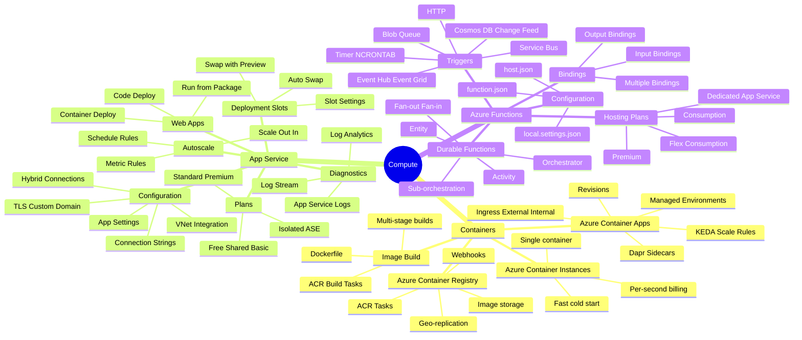
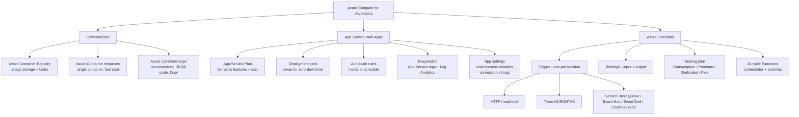

# Develop Azure compute solutions

> Domain 1 of AZ-204. Weight: **25-30%**.

## Skills measured

- **Implement containerized solutions** - create/manage container images; publish to Azure Container Registry (ACR); run with Azure Container Instances (ACI); build apps on Azure Container Apps.
- **Implement Azure App Service Web Apps** - create web apps; configure diagnostics + logging; deploy code or containers; configure TLS, API settings, service connections; implement autoscaling; configure deployment slots.
- **Implement Azure Functions** - create + configure a Functions app; implement input/output bindings; implement triggers (data ops, timers, webhooks).

## Domain mind map

## Concept map

## Decision reference

| When you see... | Pick... | Why |
|---|---|---|
| Long-running web app, scheduled or always-on | **App Service Web App** | Built-in scaling, slots, easy CI/CD |
| Event-driven, short-lived, scale-to-zero | **Functions (Consumption)** | Pay per execution, automatic scale |
| Microservices that need scale-to-zero + Dapr | **Container Apps** | KEDA + revisions, no full AKS overhead |
| One container, ephemeral, fast | **Container Instances** | Per-second billing, no orchestrator |
| Build/push container images, geo-replication | **Container Registry** | OCI-compliant + ACR Tasks |
| App Service deploy with zero downtime | **Slot + swap** | Pre-warm, configuration swap, instant rollback |
| Functions need durable state across calls | **Durable Functions** | Orchestrator pattern, eternal orchestrations |
| Functions need VNet, no cold start | **Premium / Flex Consumption plan** | Always-warm instances, VNet integration |

## Key services

**Azure Container Registry (ACR).** OCI-compliant private registry. Tiers: Basic, Standard, Premium (geo-replication, content trust, private link). ACR Tasks build images on push, on schedule, or on base-image update. Authenticate with Entra ID, admin user, service principal, or managed identity (`az acr login --identity`).

**Azure Container Instances (ACI).** Single container or container group (multiple containers sharing lifecycle/network). No orchestrator. Per-second billing. Used for burst, build agents, or ephemeral jobs. Container groups support sidecars but no horizontal scale.

**Azure Container Apps (ACA).** Managed Kubernetes-derived runtime. Concepts: **environment** (boundary, log destination), **container app** (deployable), **revision** (immutable snapshot), **replica** (running instance). Scale rules powered by **KEDA** - HTTP, queue length, custom. Built-in **Dapr** sidecar for state, pub/sub, bindings.

**App Service Web Apps.** PaaS for HTTP apps. **App Service Plan** sets pricing tier (F1/B/S/P/I). Features by tier: deployment slots (S+), autoscale (S+), VNet integration (S+), Private Endpoint (P+). **Slots** are full apps with their own URL - config can be **slot-specific** or **swappable**. Slot swap warms the new slot before traffic shift.

**App Service deployment.** Methods: ZIP deploy, run-from-package, container image, GitHub Actions, Azure DevOps, FTP. **Run-from-package** mounts the zip as a read-only volume - fastest start, atomic.

**App Service settings.** App settings = environment variables. Connection strings exposed with prefixes (`SQLAZURECONNSTR_`, `MYSQLCONNSTR_`...). Use **Key Vault references** for secrets - `@Microsoft.KeyVault(SecretUri=...)` with managed identity.

**Azure Functions.** Serverless. Each function has exactly one **trigger**. **Bindings** are input or output declarations - no boilerplate SDK code. Hosting plans: **Consumption** (true serverless, scale-to-zero, cold starts), **Premium** (pre-warmed, VNet, longer timeouts), **Dedicated/App Service** (uses an existing plan), **Flex Consumption** (per-instance memory + concurrency, VNet, fast scale).

**Function bindings.** Declared in `function.json` (script) or attributes (C#/Java). Input binding fetches data automatically (e.g. read a Cosmos doc). Output binding writes the return value (e.g. enqueue a Service Bus message). Multiple output bindings are allowed; only one trigger.

**Durable Functions.** Stateful orchestration on top of Functions. Patterns: **function chaining**, **fan-out/fan-in**, **async HTTP API**, **monitor**, **human interaction**. Orchestrator code must be deterministic (no DateTime.Now, no random).

## Common pitfalls

- Putting secrets in app settings instead of **Key Vault references** - leaks via Azure Resource Manager templates and audit logs.
- Forgetting that **slot settings** are sticky - a setting marked Deployment slot setting stays with the slot during swap.
- Using Consumption plan for VNet-required workloads - pick **Premium**, **Dedicated**, or **Flex Consumption**.
- Writing non-deterministic code in a Durable orchestrator - re-replay during recovery breaks the run.
- Confusing **Container Apps** revisions (immutable, can run side-by-side for blue/green) with App Service slots.
- Setting `WEBSITE_RUN_FROM_PACKAGE=1` then editing files in `wwwroot` - file system is read-only.
- Mixing **isolated worker** vs **in-process** Functions models in C# - different DI, different package set.

## Microsoft Learn

- [Implement Azure App Service web apps](https://learn.microsoft.com/training/paths/create-azure-app-service-web-apps/)
- [Implement Azure Functions](https://learn.microsoft.com/training/paths/implement-azure-functions/)
- [Implement containerized solutions](https://learn.microsoft.com/training/paths/az-204-implement-iaas-solutions/)

---

[ Master Index](00-MASTER-INDEX.md) - [Develop for Azure storage '](02-storage.md)