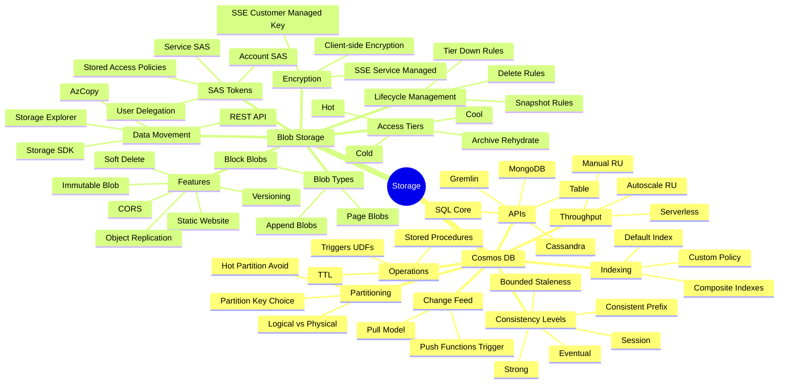
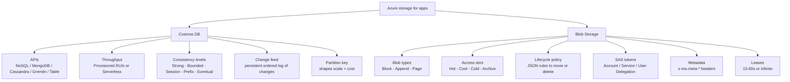

# Develop for Azure storage

> Domain 2 of AZ-204. Weight: **15-20%**.

## Skills measured

- **Develop solutions that use Azure Cosmos DB** - operations on containers/items via SDK; set the appropriate consistency level; implement change feed notifications.
- **Develop solutions that use Azure Blob Storage** - set/retrieve properties + metadata; perform data operations via SDK; implement storage policies and lifecycle management.

## Domain mind map

## Concept map

## Decision reference

| When you see... | Pick... | Why |
|---|---|---|
| Global low-latency reads + writes | **Cosmos DB** with multi-region | Single-digit ms reads anywhere |
| Need read-your-own-writes within a session | **Session consistency** (default) | Cheaper than Strong, hides eventual model |
| Cross-region writes must always agree | **Strong consistency** | At cost of write latency + RU |
| Bursty workload, unpredictable RU | **Serverless** Cosmos | Pay per RU consumed, 1M RU/month limit |
| Reactive trigger when an item changes | **Change feed** + Functions | Built-in trigger, persistent |
| Static website assets, low cost | **Blob $web** + CDN | Anonymous read, custom domain |
| Files rarely accessed but readable in ms | **Cool tier** | Lower storage cost, higher access cost |
| Files only kept for compliance, hours-to-rehydrate | **Archive tier** | Lowest storage, must rehydrate first |
| Time-bound user-scoped delegated access | **User delegation SAS** | Signed by Entra ID identity, revocable |
| Container-level scoped key access | **Stored access policy** + service SAS | Revoke by deleting policy |

## Key services

**Cosmos DB SDK operations.** Resources: account ' database ' container ' item. Container has a **partition key** chosen at creation - immutable. Operations: `CreateItemAsync`, `ReadItemAsync`, `UpsertItemAsync`, `ReplaceItemAsync`, `DeleteItemAsync`. Each takes the item id + partition-key value. Use **point reads** (id + PK) when possible - cheapest at 1 RU.

**Cosmos consistency.** Strongest ' weakest: **Strong**, **Bounded staleness**, **Session** (default), **Consistent prefix**, **Eventual**. Account-level setting; clients can request weaker per request, never stronger. Strong rules out multi-region writes pre-write-region quorum.

**Cosmos change feed.** Persistent log of inserts + updates (not deletes) per partition key range. Two access modes: **pull model** (SDK, manual checkpoint) and **push model** via **change feed processor** library or **Azure Functions Cosmos DB trigger**. Multiple consumers via lease container.

**Cosmos request units (RU).** Currency for throughput. Each operation costs RU. Provision **manual** RU/s on container or database (shared), or use **autoscale** (max RU/s, billed for consumed up to 10%/min). **Serverless** charges per RU consumed.

**Blob types.** **Block blobs** for files (most common, up to ~190 TiB). **Append blobs** for logs (append-only). **Page blobs** for VHDs (random read/write, up to 8 TiB).

**Blob access tiers.** **Hot** (highest storage cost, lowest access). **Cool** (>=30 days). **Cold** (>=90 days). **Archive** (>=180 days, offline - must rehydrate). Tier set at account default level or per blob; lifecycle policies automate transitions.

**Blob lifecycle policy.** JSON rules with `filterSet` (prefixMatch, blobTypes, blobIndexMatch) and `actions` (tierToCool/Cold/Archive, delete) keyed off `daysAfterModificationGreaterThan`, `daysAfterCreationGreaterThan`, `daysAfterLastAccessTimeGreaterThan` (requires last-access tracking on).

**Blob metadata + properties.** **Properties** are system-defined (Content-Type, Content-MD5, Cache-Control). **Metadata** is user-defined name/value pairs sent as `x-ms-meta-*` headers. Both retrievable via `GetPropertiesAsync` / `SetMetadataAsync`.

**Blob SAS.** **Account SAS** (most powerful, signed with account key). **Service SAS** (one resource, signed with account key, can reference a stored access policy). **User delegation SAS** (signed with an Entra ID OAuth token - preferred, no shared key, revocable by revoking the user delegation key).

## Common pitfalls

- Choosing the wrong **partition key** in Cosmos - hot partitions cap throughput at 10k RU/s per logical partition.
- Reading at the wrong **consistency level** - Strong on a multi-region write account silently fails to provision.
- Cosmos **change feed** does not include deletes - model deletes as soft-deletes (TTL on a deletedAt item).
- Blob **lifecycle to Archive** is one-way - re-reading requires a multi-hour rehydration.
- Generating SAS with **account key** when long-lived - prefer **user delegation SAS**.
- Forgetting that blob **metadata** keys must be valid C# identifiers (no dashes, ASCII only).
- App reads Cosmos DB without **session token** propagation, hits a different replica, sees stale data.

## Microsoft Learn

- [Develop solutions that use Azure Cosmos DB](https://learn.microsoft.com/training/paths/az-204-develop-solutions-that-use-azure-cosmos-db/)
- [Develop solutions that use Blob storage](https://learn.microsoft.com/training/paths/develop-solutions-that-use-blob-storage/)

---

[ Develop Azure compute solutions](01-compute.md) - [Implement Azure security '](03-security.md)