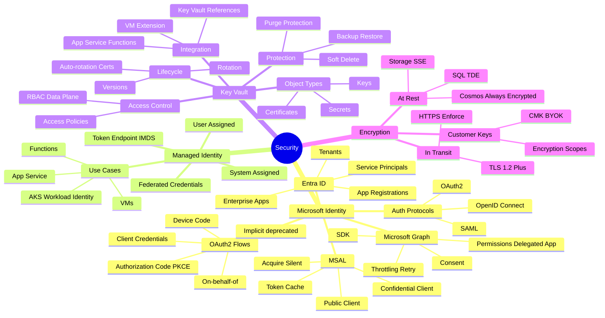
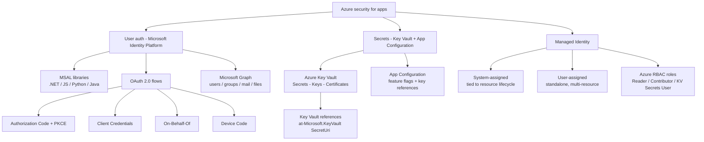

# Implement Azure security

> Domain 3 of AZ-204. Weight: **15-20%**.

## Skills measured

- **Implement user authentication and authorization** - authenticate/authorize users via the Microsoft Identity platform; use Microsoft Entra ID; create + use shared access signatures; integrate with Microsoft Graph.
- **Implement secure Azure solutions** - secure config with App Configuration / Key Vault; develop with keys, secrets, certificates in Key Vault; implement managed identities.

## Domain mind map

## Concept map

## Decision reference

| When you see... | Pick... | Why |
|---|---|---|
| User signs in to a web app with Microsoft account | **Authorization Code + PKCE** | Standard interactive web flow |
| Daemon / background service calls Azure API | **Client Credentials** | App-only token, no user |
| Web API calls a downstream API as the signed-in user | **On-Behalf-Of** | Forward user identity, get new token |
| CLI / no browser, low-trust device | **Device Code** | User goes to URL on phone to log in |
| App needs to read app settings without secrets | **Managed Identity + Key Vault refs** | No secrets in config or code |
| Time-limited blob URL for download | **User delegation SAS** | Entra-signed, scoped, revocable |
| App must call Microsoft Graph for user mail | **Delegated Mail.Read** scope | User-context permission |
| Function uses a different identity per resource | **User-assigned MI** | Reusable across many resources |
| Container needs short-lived secret access | **System-assigned MI** + AcquireToken | Resource-bound, auto-rotated |

## Key services

**Microsoft Identity Platform.** OAuth 2.0 + OpenID Connect on top of **Microsoft Entra ID**. Apps registered in tenant get **Application (client) ID**, **tenant ID**, and zero or more **client secrets** / **certificates** / **federated credentials**. Permissions split into **delegated** (user is signed in) vs **application** (app-only).

**MSAL.** Microsoft Authentication Library - recommended. Public client = installed/native/SPA (no secret can be kept). Confidential client = web app/API/daemon (can keep a secret/cert). Use MSAL **token cache** to avoid re-prompts; serialize per user.

**Authorization Code + PKCE.** Standard interactive flow for web + SPA. Browser redirects to login then returns short `code` + `state` then backend (or SPA via PKCE) exchanges code for tokens at the token endpoint.

**Client Credentials.** App authenticates with its own credential (secret/cert/federated identity) and receives an app-only access token. Used for batch jobs, daemons, and service-to-service calls.

**On-Behalf-Of (OBO).** A web API receives a user token, then calls a downstream API as that user. Requires `assertion`, `requested_token_use=on_behalf_of`. Both APIs must trust the same audience configuration.

**Device Code.** Browser-less: device prints a `verification_uri` + short user code; user visits URL on another device, signs in, approves; original device polls until tokens issued.

**Microsoft Graph.** Single REST endpoint (`https://graph.microsoft.com/v1.0`) for users, groups, mail, calendar, Teams, SharePoint, files. Use **Microsoft Graph SDK** (`GraphServiceClient`) with a token credential (DefaultAzureCredential, MSAL, etc.). Permissions are scopes like `User.Read`, `Mail.ReadWrite`.

**Azure Key Vault.** Vault types: **standard** (software-protected) and **premium** (HSM-backed for keys/certs). Three object types: **Secrets** (text up to 25 KB), **Keys** (cryptographic operations server-side), **Certificates** (combines a key + cert + auto-renewal policy).

**Key Vault access.** Two models: **RBAC** (recommended - Azure built-in roles like `Key Vault Secrets User`) or legacy **access policies** (per-vault permission lists). RBAC is granular, audited, and Entra-native.

**Key Vault references in App Service / Functions.** App setting value of the form `@Microsoft.KeyVault(SecretUri=https://VAULT.vault.azure.net/secrets/NAME/VER)` or `@Microsoft.KeyVault(VaultName=...;SecretName=...)`. Resolved by the platform using the resource managed identity.

**Azure App Configuration.** Centralized, hierarchical app settings + **feature flags**. Supports **Key Vault references** for secret values (resolved by SDK using configured credential), labels (per environment), and snapshot/import.

**Managed Identity.** **System-assigned**: created with a resource, deleted with it. **User-assigned**: standalone resource, can be attached to many. Get tokens via the platform endpoint (e.g. `IDENTITY_ENDPOINT` env var) or `DefaultAzureCredential`. Assign Azure RBAC roles to the identity.

**Shared Access Signatures (SAS).** **Account SAS** (broad, account key signed). **Service SAS** (one service, account key signed, can reference a **stored access policy** for revocation). **User delegation SAS** (Entra-signed, only for Blob/Queue/Table - preferred). All SAS tokens carry an expiry, signed permissions, and resource scope.

## Common pitfalls

- Storing **client secrets** in source control / app settings instead of using **federated credentials** + **managed identity**.
- Using **delegated** permissions for a daemon - must be **application** scope.
- Forgetting to grant the managed identity an Azure RBAC role on Key Vault - `Key Vault Secrets User` for read.
- Using SAS signed with the storage **account key** for long-lived access - prefer **user delegation SAS** with short expiry.
- Mixing v1.0 and v2.0 token endpoints - v2.0 issues ID tokens with `aud=clientId`, v1.0 issues with `aud=resourceUri`.
- Hard-coding **tenant ID** and **client ID** in code - load from app settings / environment.
- Calling Microsoft Graph with the wrong scope - `User.Read` reads the signed-in user only; `User.Read.All` is admin-consent.

## Microsoft Learn

- [Implement user authentication and authorization](https://learn.microsoft.com/training/paths/az-204-implement-authentication-authorization/)
- [Implement secure Azure solutions](https://learn.microsoft.com/training/paths/az-204-implement-secure-cloud-solutions/)

---

[ Develop for Azure storage](02-storage.md) - [Monitor, troubleshoot, optimize '](04-monitor.md)