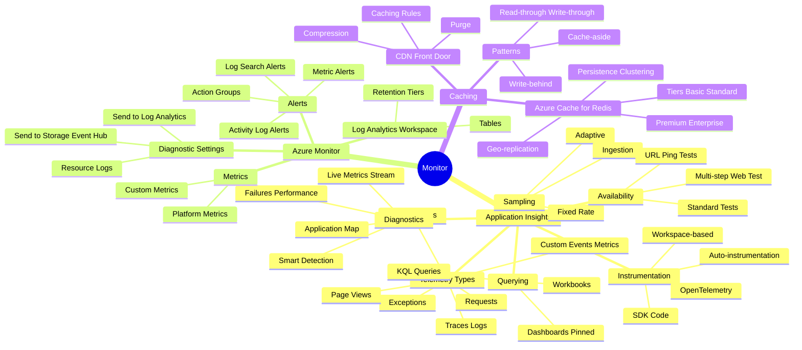
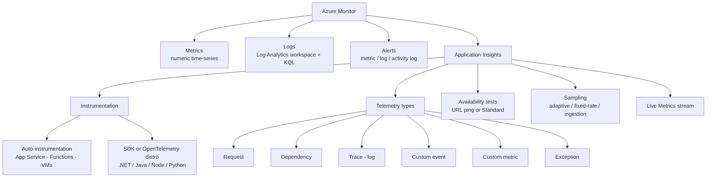

# Monitor, troubleshoot, and optimize Azure solutions

> Domain 4 of AZ-204. Weight: **5-10%**.

## Skills measured

- **Monitor and troubleshoot solutions by using Azure Monitor Application Insights** - monitor + analyze metrics, logs, traces; implement availability tests + alerts; instrument an app or service.

## Domain mind map

## Concept map

## Decision reference

| When you see... | Pick... | Why |
|---|---|---|
| Need request and dependency timing for a web app | **Application Insights** auto-instrumentation | Zero-code on App Service / Functions |
| Custom domain language metrics | `TelemetryClient.TrackMetric` or **OpenTelemetry meter** | Surfaces in Metrics + Logs |
| Cross-service trace correlation | **W3C Trace Context** (default in AI SDK + OTel) | Operation_Id flows across services |
| Health check from outside Azure | **Standard availability test** | Multi-region, supports auth + assertions |
| Reduce ingestion cost on a chatty service | **Adaptive sampling** | Auto-keeps representative items |
| Alert on slow SQL calls | **Log alert** with KQL on `dependencies` | Filter by name, percentile p95 |
| 500 errors over threshold | **Metric alert** on `requests/failed` count | Faster than log alert |
| Real-time problem investigation | **Live Metrics** | 1-second latency, no storage |

## Key services

**Application Insights instrumentation.** Three approaches:
1. **Auto-instrumentation** - toggle Application Insights on App Service / Functions / VM. No code change. Best for getting started.
2. **SDK** (`Microsoft.ApplicationInsights.AspNetCore`) - explicit, more control over filters + processors.
3. **OpenTelemetry distro** (`Azure.Monitor.OpenTelemetry.AspNetCore`) - newest path, vendor-neutral, recommended for new code.

**Telemetry data model.** **Request** (server-side handled call), **Dependency** (outgoing call: SQL, HTTP, queue), **Trace** (log line), **Exception** (caught/uncaught), **Event** (custom domain), **Metric** (numeric). All correlated by `operation_Id` + `operation_ParentId` (W3C Trace Context).

**Connection string.** Replaces instrumentation key. Format: `InstrumentationKey=...;IngestionEndpoint=...;LiveEndpoint=...;ApplicationId=...`. Read from `APPLICATIONINSIGHTS_CONNECTION_STRING` env var. Required for sovereign clouds.

**Sampling.** **Adaptive** (default in ASP.NET) - auto-adjusts rate to a target items/sec. **Fixed-rate** - keep N percent of telemetry. **Ingestion** - server-side sampling at the AI endpoint. Sampling preserves correlation: a sampled request samples its dependencies + exceptions together.

**Availability tests.** **URL ping** (deprecated for new resources) and **Standard test** (configurable HTTP, multi-region, header + content validation, supports authentication). Run on a schedule; raise alerts on failure threshold.

**Alerts.** Three signal types: **metric** (fast, simple comparisons), **log** (KQL query, more flexible, slower), **activity log** (admin operations on the resource). Alerts route to **Action Groups** (email, SMS, webhook, Logic App, Functions, Event Grid).

**KQL essentials.**
- `requests | where success == false | summarize count() by bin(timestamp, 5m), name`
- `dependencies | where target contains "sql" | summarize percentile(duration, 95) by name`
- `exceptions | take 50 | project timestamp, type, outerMessage, operation_Id`

**Live Metrics.** 1-second-latency stream - request rate, failed rate, average duration, dependency telemetry. Filtered server-side, never persisted.

## Common pitfalls

- Forgetting to set `APPLICATIONINSIGHTS_CONNECTION_STRING` on Functions - old `APPINSIGHTS_INSTRUMENTATIONKEY` is deprecated.
- Adding both SDK + auto-instrumentation - telemetry duplicated.
- Disabling sampling without raising the daily ingestion cap - runaway cost.
- Using metric alerts on log-derived signals - log alerts have query lag (1-5 minutes).
- Logging PII in custom events - Application Insights is not GDPR-compliant by default; scrub via `ITelemetryProcessor`.
- Ignoring `cloud_RoleName` - without it, the application map merges every service.

## Microsoft Learn

- [Instrument solutions to support monitoring and logging](https://learn.microsoft.com/training/paths/az-204-instrument-solutions-support-monitoring-logging/)

---

[ Implement Azure security](03-security.md) - [Connect to services '](05-connect.md)