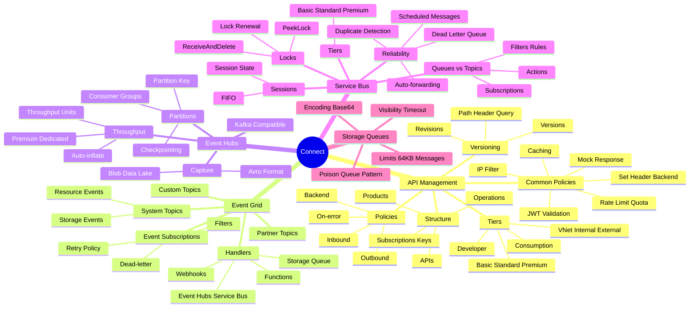
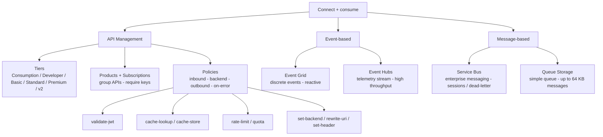

# Connect to and consume Azure services and third-party services

> Domain 5 of AZ-204. Weight: **20-25%**.

## Skills measured

- **Implement Azure API Management** - create an APIM instance; create + document APIs; configure access; implement policies for APIs.
- **Develop event-based solutions** - Azure Event Grid; Azure Event Hubs.
- **Develop message-based solutions** - Azure Service Bus; Azure Queue Storage.

## Domain mind map

## Concept map

## Decision reference

| When you see... | Pick... | Why |
|---|---|---|
| Single front door for many backend APIs | **API Management** | Auth, rate-limit, transform, doc portal |
| Reactive notification of resource state change | **Event Grid** | Push, retry, dead-letter, MQTT v5 broker |
| Millions of events per sec for analytics | **Event Hubs** | Pull (Kafka-compatible), capture to Blob |
| Ordered first-in-first-out message processing | **Service Bus queue with sessions** | Session-id grouping, lock per session |
| Pub/sub fan-out with filters | **Service Bus topic + subscriptions** | SQL filter on properties |
| Simple background job queue, free tier | **Storage Queue** | Cheapest, 64 KB max message |
| Streaming with Kafka clients | **Event Hubs Kafka endpoint** | Drop-in protocol |
| Validate caller token at the edge | **APIM validate-jwt policy** | Verify Entra signature + claims |
| Cache GET responses for 60s | **APIM cache-lookup / cache-store** | Internal cache or external Redis |
| Send a poison message somewhere safe | **Service Bus dead-letter queue** | Built-in DLQ per queue/subscription |

## Key services

**Azure API Management (APIM).** Entry point for backend APIs. Pieces: **API** (a set of operations), **Product** (groups APIs, requires/optional subscription keys), **Subscription** (key-based caller identity), **Policy** (XML pipeline). Tiers: Consumption (pay-per-call), Developer, Basic, Standard (with built-in cache), Premium (multi-region + VNet + zone redundancy), **v2 SKUs** (Basic v2, Standard v2 - faster scale, simpler networking).

**APIM policies.** XML pipeline applied at four scopes (global, product, API, operation), four sections: **inbound** (request), **backend** (forward), **outbound** (response), **on-error**. Common policies: `validate-jwt`, `rate-limit-by-key`, `quota-by-key`, `set-backend-service`, `rewrite-uri`, `set-header`, `cache-lookup` and `cache-store`, `send-request`, `return-response`.

**APIM auth.** Subscription key (`Ocp-Apim-Subscription-Key` header), OAuth 2.0 (validate-jwt), client cert, managed identity to call backend.

**Event Grid.** Reactive event broker. **System topics** (Azure resource events: Storage, Resource Group, Key Vault), **Custom topics**, **Domain topics** (multi-tenant), **Partner topics** (3rd-party SaaS), **Event Grid Namespaces** (MQTT broker + pull delivery + JSON-RPC). Push delivery to webhooks/Functions/Event Hubs/Service Bus/Storage Queues. Built-in retry (24 hours, exponential backoff) + dead-letter to a Storage account.

**Event Grid schemas.** **Event Grid schema** (default), **CloudEvents v1.0** (recommended for portability), **custom**. Each event has `id`, `subject`, `type`, `time`, `data`.

**Event Hubs.** Big data streaming platform. **Namespace** to **Event Hub** (= Kafka topic) to **Partitions** (1-1024). Producers send by **partition key** (hash to partition). Consumers organized in **consumer groups**; each maintains independent **offset** and **checkpoint** in a Blob container. **Capture** writes streams to Blob/Data Lake.

**Service Bus.** Enterprise broker. **Queues** (point-to-point), **Topics + Subscriptions** (pub-sub with SQL filters or correlation filters). Features: **sessions** (FIFO group), **scheduled enqueue**, **dead-letter** (per-entity), **deferral**, **transactions** across entities in same namespace, **duplicate detection** (10 min default).

**Service Bus message lock.** **Peek-Lock** receive mode - message is locked for `LockDuration` (default 60s, max 5m); call `Complete` (delete), `Abandon` (release for retry, increment delivery count), `DeadLetter` (send to DLQ), or `Defer`. **ReceiveAndDelete** mode is at-most-once.

**Queue Storage.** Simple HTTP queue, part of a storage account. Up to 64 KB per message, 7-day max TTL, no ordering guarantee, no dead-letter (DIY by moving to a poison queue). Cheapest option for plain background jobs.

## Common pitfalls

- Putting **secrets in policy XML** at APIM - use **named values** with **Key Vault references**.
- APIM `validate-jwt` without `<required-claims>` - accepts any token from the issuer.
- Choosing Event Grid for **time-ordered telemetry** - use Event Hubs.
- Picking Storage Queues for messages over 64 KB - must move to Service Bus (256 KB Standard, 100 MB Premium).
- Forgetting to **abandon** a Service Bus message in error handling - lock expires, message is redelivered later (delivery count grows toward DLQ).
- Hard-coding APIM tier in IaC for a workload that needs VNet - only Premium or v2 with VNet integration support private backends.
- Event Hubs **partition count** is fixed at create on Standard; only **Premium / Dedicated** allow change.

## Microsoft Learn

- [Implement API Management](https://learn.microsoft.com/training/modules/explore-api-management/)
- [Develop event-based solutions](https://learn.microsoft.com/training/paths/az-204-develop-event-based-solutions/)
- [Develop message-based solutions](https://learn.microsoft.com/training/paths/az-204-develop-message-based-solutions/)

---

[ Monitor, troubleshoot, optimize](04-monitor.md) - [Exam Decision Reference '](05-exam-cheatsheet.md)