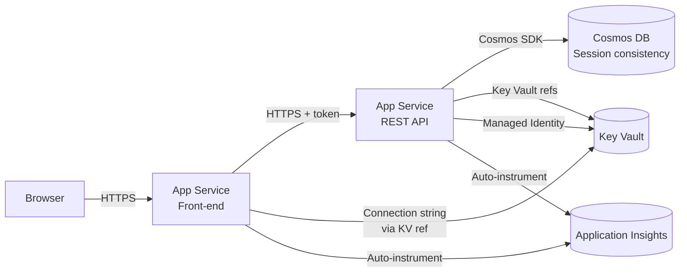
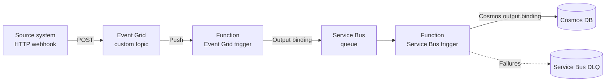
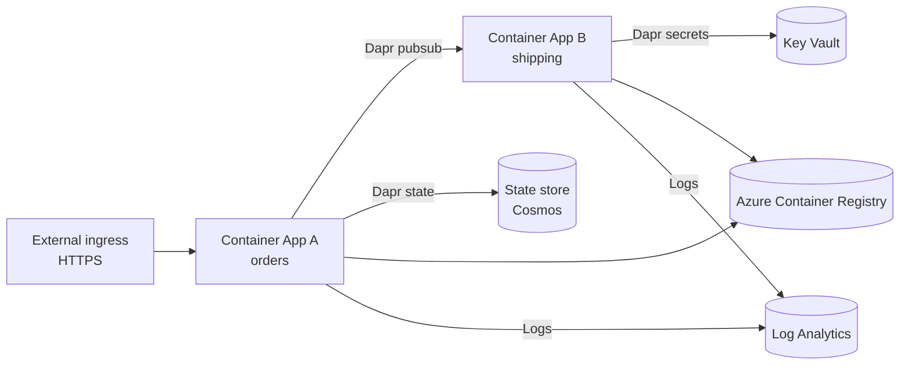
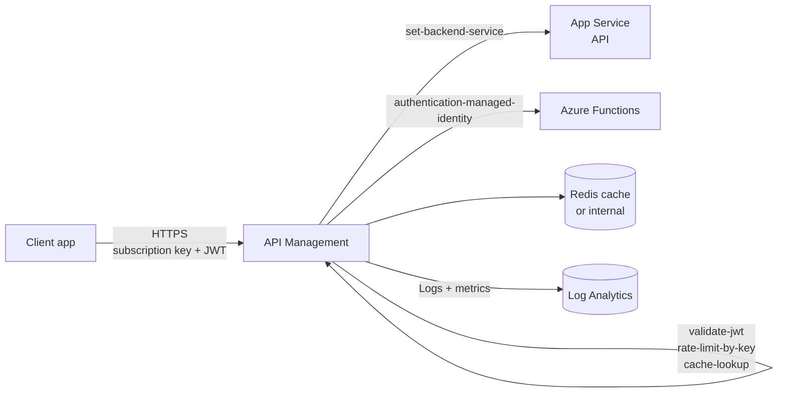
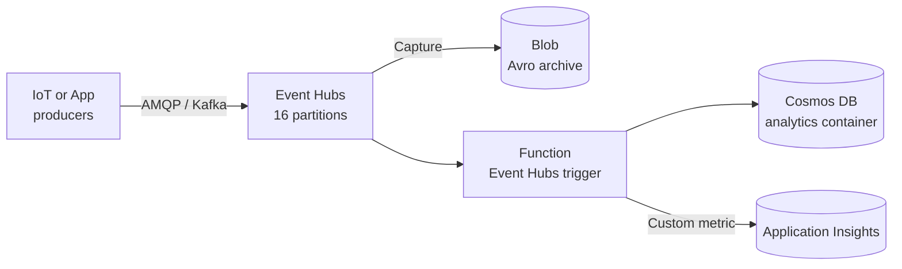

# AZ-204 Reference Architectures

> End-to-end developer-centric architectures stitched from AZ-204 services.

## 1. Web app + API + Cosmos with managed identity

**Key choices** - Authorization Code + PKCE for the user flow, On-Behalf-Of from front-end App Service to API. Both apps use a system-assigned managed identity with `Key Vault Secrets User` role. Cosmos uses Session consistency. Application Insights via auto-instrumentation; OpenTelemetry distro could replace it.

## 2. Event-driven Functions pipeline

**Why two stages** - Event Grid for fan-out, Service Bus to buffer + provide DLQ + ordering. Functions Premium plan to keep latency low.

## 3. Container Apps microservices with Dapr

**Notes** - Container Apps environment shares the Log Analytics workspace + VNet. KEDA scales B from queue length; Dapr sidecar abstracts state and pub/sub.

## 4. APIM front door for backend APIs

**Notes** - Inbound section validates JWT and applies rate-limit. Backend section sets the upstream service and authenticates with managed identity. Outbound section caches successful 200 responses.

## 5. Streaming telemetry into Event Hubs + Functions + Cosmos

**Notes** - Event Hubs Capture writes raw stream to Blob for replay. Function uses checkpoint container for at-least-once processing. Cosmos analytics container with autoscale RU.

---

[ Master Index](00-MASTER-INDEX.md)